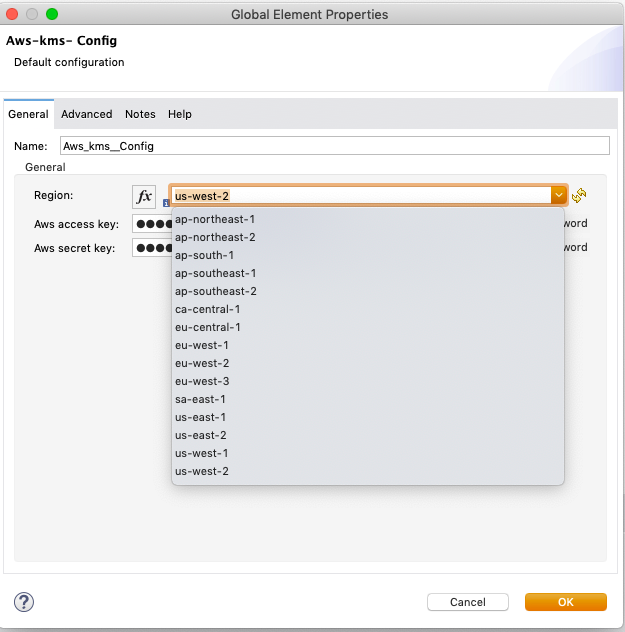

# AWS Key Management Service (KMS) extension for Mule 4

This module will encrypt and decrypt the sensitive data using the keys stored in AWS Key Management Service (KMS)
- encrypt the sensitive data with KMS key
- decrypt the sensitive data in Base64 encoded string to planText using KMS

## Deploying to Exchange
Clone the project to your local, change the groupId to point your orgId. Issue `mvn deploy`.
Ensure that there is an entry in your settings.xml pertaining to Exchange2

## Local Install
For local install, give any groupId. Issue `mvn clean install`

## Using the module in a Mule4 Project
Add this dependency to your application pom.xml

```
<dependency>
	<groupId>${groupId}</groupId>
	<artifactId>aws-kms-connector</artifactId>
	<version>${version}</version>
	<classifier>mule-plugin</classifier>
</dependency>

```

## Configuration

### Region
Regions are provided in a drop down format.


### Access and Secret Keys
These should be provided as part of the wrapper.conf or during deployment.
These can be provided through secure properties also.


### Example Config
A sample config.
```
<aws-kms:config name="Aws_kms__Config" region="us-west-2"
  doc:name="Aws-kms- Config" doc:id="ffa435e1-9105-4cb9-9f71-7fced23b93a4"
  awsAccessKey="${secure::aws.access.key}"
  awsSecretKey="${secure::aws.secret.key}" />

```


## Operations

### Encrypt
This will encrypt the plaintext (sensitive data) using key stored in AWS KMS.
-
```
<aws-kms:encrypt doc:name="Encrypt"
  doc:id="99a95d79-198e-4b2d-9635-b2b0f31dba55" config-ref="Aws_kms__Config" awsARNKeyId="${secure::aws.kms.arnkeyId}"
  plainText="Hello World" />
```

### Decrypt
This will decrypt the  encryptedBase64String to plaintext.

```
<aws-kms:decrypt doc:name="Decrypt"
  doc:id="ffe8b3c1-17d5-4909-810a-99349ffc891c" config-ref="Aws_kms__Config"
  encryptedBase64String="#[output text/plain --- vars.encryptedBase64String]" />
```

## Contributors
Srinivasan Raghunathan